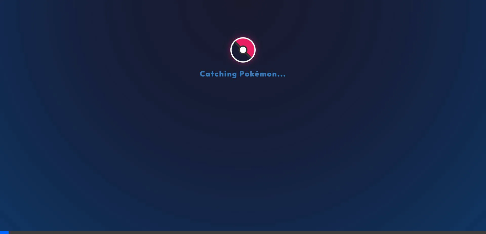

<div align="center">
  
  <h1 align="center">🌟 Premium Pokémon Dex 🌟</h1>
  <p align="center">
    A stunning, next-generation Pokémon Pokédex application featuring a modern glassmorphic UI, dynamic themeing, and rich micro-animations.
  </p>
</div>

---

## 🎨 The 100x Premium Interface

We have completely overhauled the user interface to deliver a top-tier aesthetic experience. 



### ✨ Key Design Features:
- **Glassmorphism:** Frosted glass effect on Pokémon cards with a subtle backdrop blur.
- **Dynamic Type Colors:** Badges, hover glows, and text dynamically match the specific type of each Pokémon.
- **Premium Dark Mode:** Deep, sophisticated gradients paired with crisp typography using the *Outfit* font.
- **Micro-animations:** Interactive hover states, glowing elements, and an animated spinner for loading data.

## 🚀 Tech Stack

- **Framework:** React + Vite
- **Styling:** Vanilla CSS (Advanced properties: CSS Variables, Backdrop Filters, Gradients, Grid)
- **API:** [PokéAPI v2](https://pokeapi.co/)
- **Typography:** [Google Fonts (Outfit)](https://fonts.google.com/specimen/Outfit)

## 🛠️ Installation & Setup

1. **Clone the repository:**
   ```bash
   git clone <your-repo-url>
   cd Pokemon
   ```

2. **Install dependencies:**
   ```bash
   npm install
   ```

3. **Start the development server:**
   ```bash
   npm run dev
   ```

4. **Open your browser:**
   Navigate to `http://localhost:5173` (or the port Vite provides) to see the magic happen.

## 🔍 Features Overview
- **Instant Search:** Filter through all 120+ Pokémon in real-time.
- **Detailed Stats:** Quick access to Height, Weight, Speed, Base Experience, Attack, and Abilities.
- **Responsive Layout:** Beautiful fluid grid that adapts perfectly to both desktop and mobile viewports.

---

<p align="center">
  <i>Built with ❤️ for Pokémon fans and web design enthusiasts.</i>
</p>
